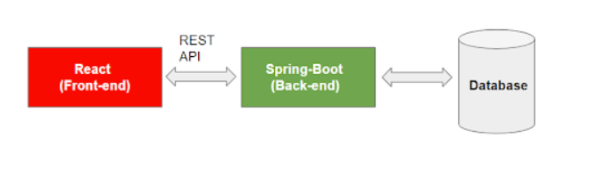
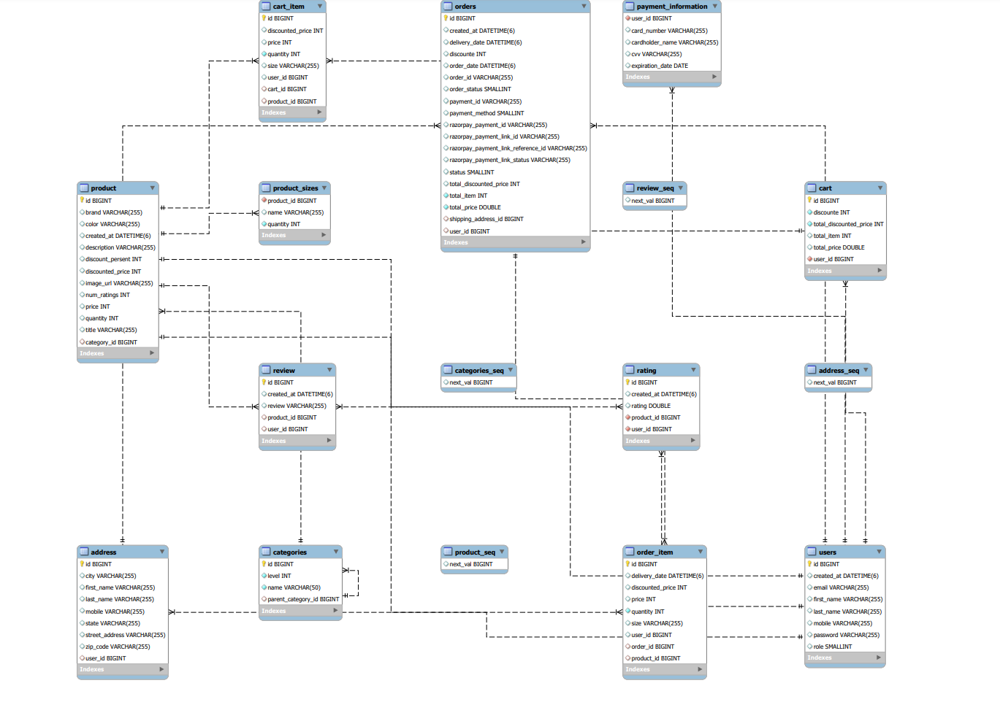

# Ecommerce Web Application

- [Ecommerce Web Application](#ecommerce-web-application)
  - [Project Scope(Functionality)](#project-scopefunctionality)
    - [Admin](#admin)
    - [Customer](#customer)
    - [Common](#common)
  - [High Level Diagram](#high-level-diagram)
  - [Spring Data Flow](#spring-data-flow)
  - [DB Architecture](#db-architecture)
  - [MySQL Installation](#mysql-installation)
    - [Create Database](#create-database)
  - [To Run Frontend code](#to-run-frontend-code)
  - [To Run Backend](#to-run-backend)
  - [Tech Stack](#tech-stack)

## Project Scope(Functionality)

### Admin

1. View User Details: Admin can view details of Customers
2. View Orders: Admin can view all the purchased orders in the system on the dashboard.
3. View Products: Admin can view all the products available in the system, similar to customers and can edit it.
4. No Ordering: Admin cannot place orders within the application.

### Customer

1. View Products: Customers should be able to browse and view products based on different categories.
2. Add to Cart: Customers can add products of their choice to their shopping cart.
3. Manage Cart: Customers can add, delete, and modify products in their shopping cart.
4. Place Orders: Customers can place orders by providing essential details such as address, phone number, payment information, net billed amount, and quantities of products.

### Common

1. Login: Users should be able to authenticate and log in to the application.
2. Register/Signup: New users should be able to create an account.

## High Level Diagram



## Spring Data Flow


## DB Architecture

[DB Architecture](./02_DB/ER_Diagram-1.0.pdf)



## MySQL Installation

To install MySQL for a Windows application, follow these steps:

1. Download MySQL Installer

Go to the official MySQL website: https://dev.mysql.com/downloads/installer/
Download the MySQL Installer for Windows. Choose the appropriate version (usually the latest stable version is recommended).

2. Run MySQL Installer

Run the MySQL Installer executable that you downloaded.
You will be presented with the MySQL Installer setup wizard. Click "Yes" if prompted for administrative privileges.

3. Choose an Installation Type

In the MySQL Installer, you'll have the option to choose an installation type. For a typical development setup, choose "Developer Default." This option will install MySQL Server, MySQL Workbench (a graphical tool for managing MySQL), and other useful tools.

4. Installation Process

Follow these steps during the installation process:

a. Accept the License Agreement.
b. Choose "Standalone MySQL Server / Classic MySQL Replication" as the setup type.
c. Click "Next" and let the installer download and install the required components.

5. MySQL Configuration

During the installation, you'll be prompted to configure MySQL:

a. Set a root password for MySQL. Choose a strong password and remember it.
b. Click "Next" to proceed with the installation.

6. MySQL Windows Service

You'll have the option to configure MySQL as a Windows service:

a. Choose "Configure MySQL Server as a Windows Service."
b. Click "Next."

7. Complete Installation

Review your configuration settings, and click "Execute" to complete the installation. MySQL Server will be installed as a Windows service, which means it will start automatically when your computer boots up.

8. Start MySQL Server

Once the installation is complete, you can start the MySQL Server service:

a. Open the Windows Services manager. You can do this by pressing Win + R, typing services.msc, and hitting Enter.
b. Find "MySQL" in the list of services.
c. Right-click on "MySQL" and choose "Start."

9. Configure Spring Boot Application

Now that MySQL is installed and running, configure your Spring Boot application as mentioned in the previous response. Update your application.properties or application.yml file with the appropriate database configuration.

10. Restart Spring Boot Application

Restart your Spring Boot application to apply the new database configuration.

That's it! MySQL should now be installed and configured for your Windows-based Spring Boot application with the specified database settings.

### Create Database

- Execute the following to config the database

```
CREATE DATABASE full_stack_ecommerce;
CREATE USER 'ecommerceapp'@'localhost' IDENTIFIED BY 'ecommerceapp';
GRANT ALL PRIVILEGES ON full_stack_ecommerce.* TO 'ecommerceapp'@'localhost';
FLUSH PRIVILEGES;
EXIT;
```

## To Run Frontend code

Prerequisites:

Node.js and npm (Node Package Manager) should be installed on your computer. You can download and install them from the official website: https://nodejs.org/

1. Navigate to the Project Directory

Change your working directory to the newly created project folder:

```
cd 00_Frontend
```

2.  Start the Development Server

To start the development server and run your React app locally, use the following command:

```
npm start
```

This command will start the development server, and your React app will be accessible at http://localhost:3000 by default.

3. Open Your React App in a Web Browser

After running npm start, your default web browser should open automatically, and you'll see your React app. If it doesn't open automatically, you can manually open a web browser and go to http://localhost:3000

## To Run Backend

1. Open your IDE.
2. Locate the main class (usually annotated with @SpringBootApplication) in your project.
3. Right-click on the main class.
4. Select "Run" or "Debug" to start the application.

## Tech Stack

- React
- Java
- Spring Boot
- Mysql
